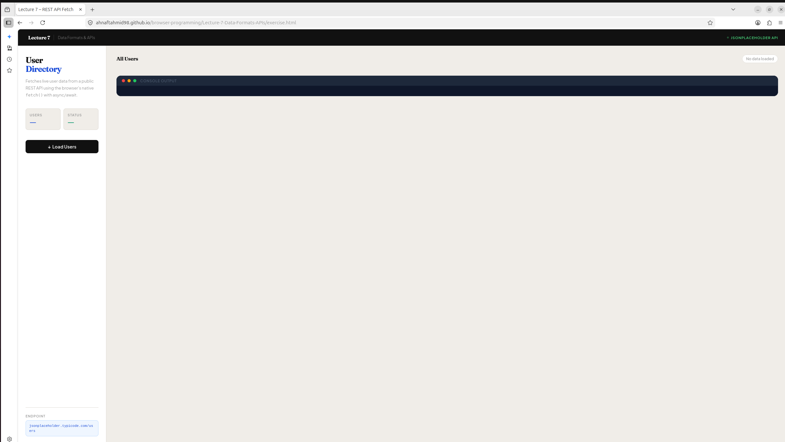
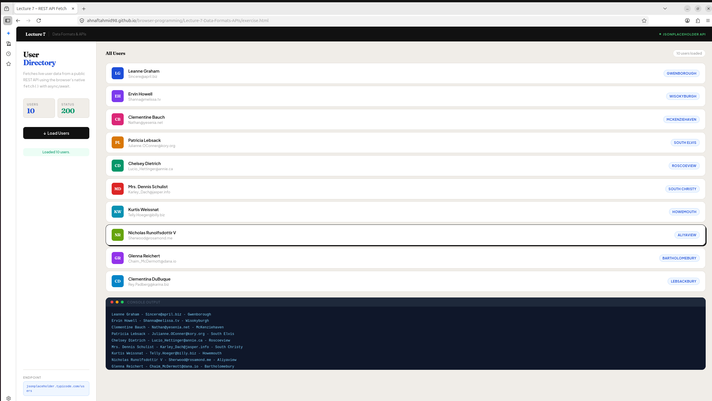

# Lecture 7 — REST API Fetch

> Loads live user data from [JSONPlaceholder](https://jsonplaceholder.typicode.com/) using the browser's native `fetch()` API with async/await.

---

## Screenshots

### Default State



### Loaded State



---

## Project Structure

```text
Lecture-7-Data-Formats-APIs/
├── exercise.html        — Page structure and layout
├── exercise.js          — API logic and DOM updates
├── exercise.css         — All styles and animations
├── README.md            — This file
└── screenshots/
    ├── default.png      — Page before clicking Load Users
    └── loaded.png       — Page after users are fetched
```

---

## Features

- Fetches 10 real users from JSONPlaceholder REST API
- Displays name, email, and city for each user
- Coloured avatar cards with initials generated from names
- Live stat counters — user count and HTTP status code
- Full error handling with `try/catch` and `response.ok` check
- Console-style log output panel
- Sidebar + main panel dashboard layout
- Staggered card animations on load

---

## How It Works — Step by Step

### Step 1 — Page Loads

Open `exercise.html` in a browser. The sidebar shows the title, stats, and the **Load Users** button. The main panel is empty — no data is fetched yet.

### Step 2 — User Clicks the Button

Clicking **Load Users** calls `loadUsers()` in `exercise.js`. The button dims, the status pill shows *"Fetching users…"* and the stat cards show `…` while waiting.

### Step 3 — fetch() Sends the Request

`fetch()` sends an HTTP GET request to the JSONPlaceholder API. This is asynchronous — the browser continues running while waiting for the response.

```js
const response = await fetch("https://jsonplaceholder.typicode.com/users")
```

### Step 4 — HTTP Status Is Checked

Before reading the data, we check `response.ok`. If the server returns an error status (like 404 or 500), we throw an error manually so the catch block handles it cleanly.

```js
if (!response.ok) {
    throw new Error("HTTP error: " + response.status)
}
```

### Step 5 — JSON Is Parsed

`response.json()` converts the raw response stream into a JavaScript array of user objects we can work with directly.

```js
const users = await response.json()
```

### Step 6 — Users Are Looped With forEach

We iterate over every user in the array. For each one we read three fields — including `city`, which is **nested** inside the `address` object.

```js
users.forEach(function(user) {
    const name  = user.name
    const email = user.email
    const city  = user.address.city   // nested field
    log(name + " - " + email + " - " + city)
})
```

### Step 7 — DOM Is Updated

Each user is rendered as a card in the `<ul id="userList">` element. The sidebar stats update to show the total count and HTTP status `200`.

```js
const li = document.createElement("li")
li.innerHTML = `
    <div class="avatar">${initials(name)}</div>
    <div class="user-meta">
        <div class="user-name">${name}</div>
        <div class="user-email">${email}</div>
    </div>
    <span class="user-city">${city}</span>
`
userList.appendChild(li)
```

### Step 8 — Errors Are Caught

If anything goes wrong (network failure, bad status, invalid JSON), the `catch` block handles it. The error message appears in both the status pill and the console log panel.

```js
catch (error) {
    log("Error: " + error.message)
    setStatus("Failed — " + error.message, "error")
}
```

---

## Testing Error Handling (Part D)

To force an error and test the catch block, temporarily change the URL in `exercise.js` to a bad endpoint:

```js
// Change this:
const response = await fetch("https://jsonplaceholder.typicode.com/users")

// To this:
const response = await fetch("https://jsonplaceholder.typicode.com/userssss")
```

Click **Load Users** — you will see `Error: HTTP error: 404` appear in the console panel.

---

## API Reference

**API used:** JSONPlaceholder — free fake REST API for testing

**Endpoint:**

```text
GET https://jsonplaceholder.typicode.com/users
```

**Example response object:**

```json
{
  "name": "Leanne Graham",
  "email": "sincere@april.biz",
  "address": {
    "city": "Gwenborough"
  }
}
```

> Note: `city` is a **nested field** — it lives inside `address`, so we access it as `user.address.city`, not `user.city`.

---

## Short Reflection

**What does fetch() return?**
`fetch()` returns a Promise that resolves to a Response object. It does not give us the data directly — it just represents the HTTP response. We must call `.json()` on it separately to read the actual content.

**Why do we use response.json()?**
The raw HTTP response is a stream of bytes, not a JavaScript object. `response.json()` reads that stream and parses it into a usable JS object or array, so we can access properties like `user.name` and `user.address.city` directly in our code.

**Why must we check response.ok?**
`fetch()` only rejects its Promise on network failures — it does NOT throw an error for HTTP error codes like 404 (Not Found) or 500 (Server Error). Without checking `response.ok`, a failed request would silently pass through as if it succeeded, making bugs very hard to find.

---

## Built With

- HTML5
- CSS3 (grid layout, custom properties, keyframe animations)
- Vanilla JavaScript (Fetch API, async/await, DOM manipulation)
- [JSONPlaceholder](https://jsonplaceholder.typicode.com/) — free public REST API
- [Google Fonts](https://fonts.google.com/) — Syne + Outfit
