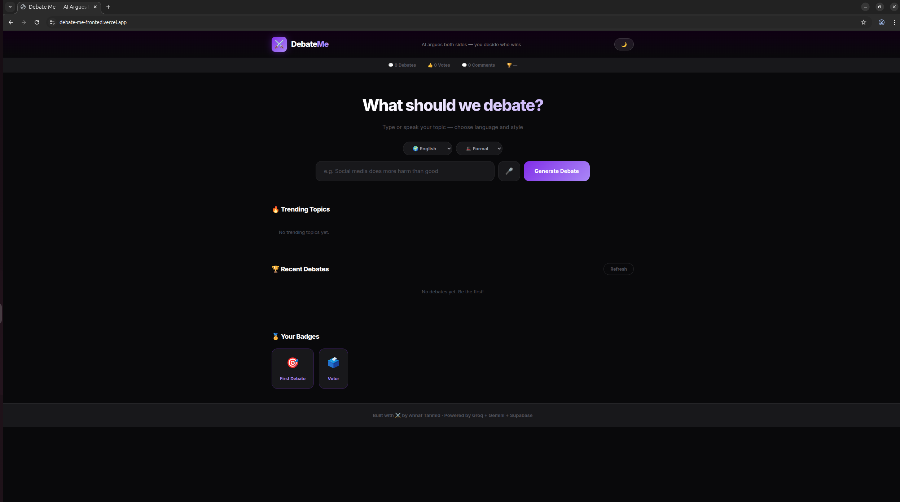
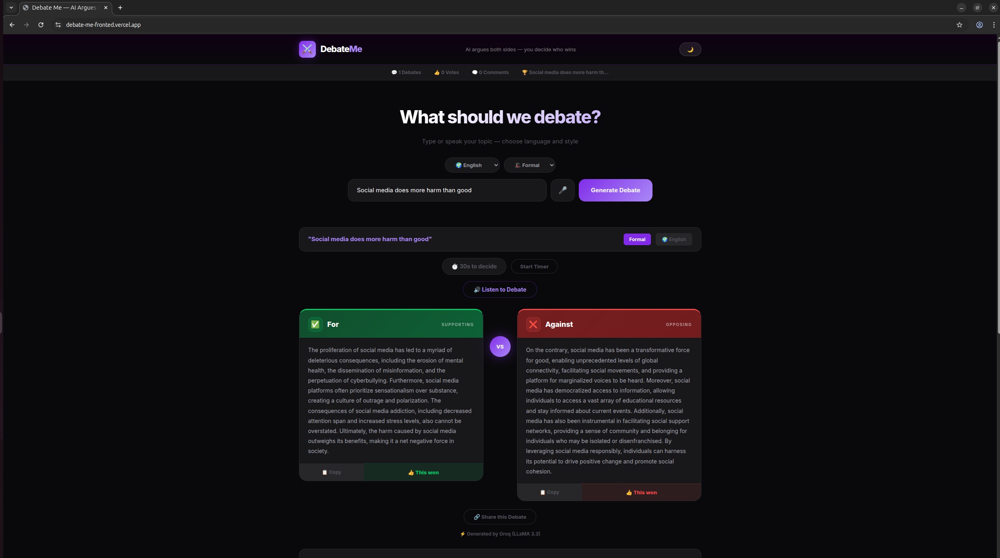
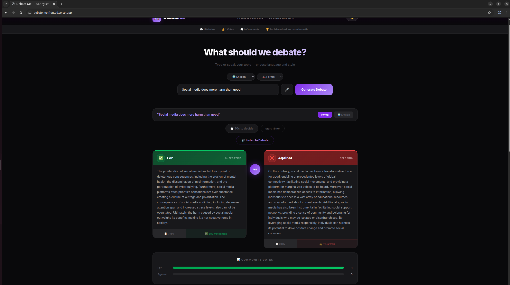
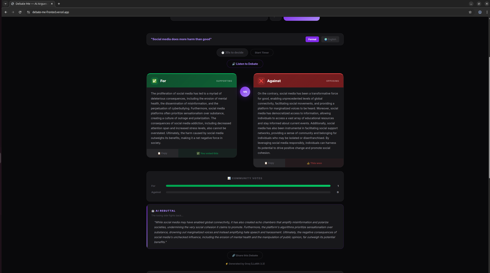
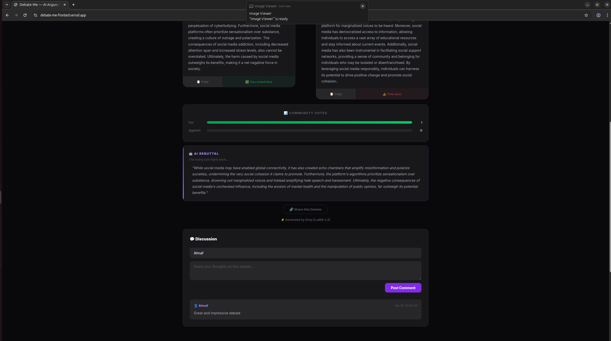
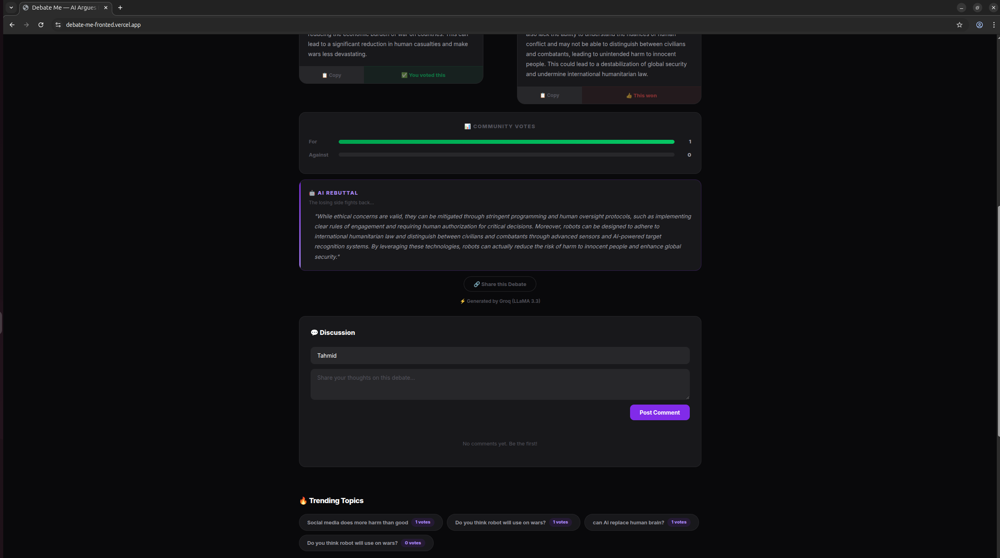
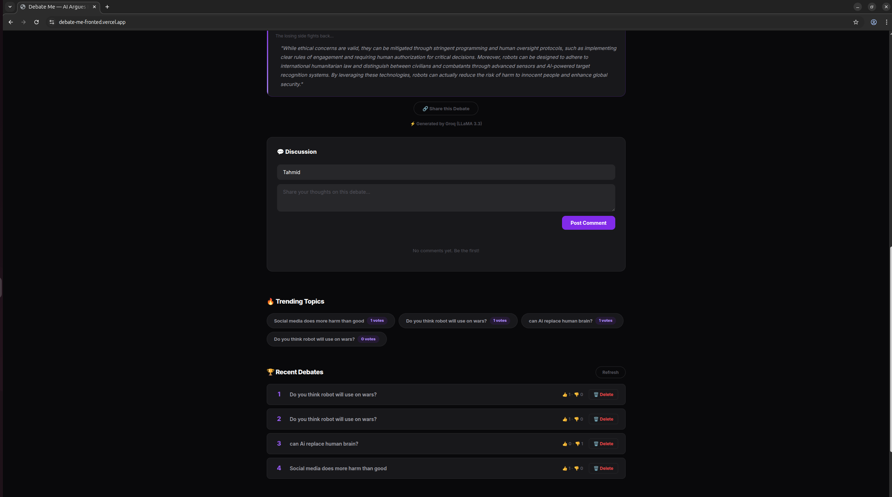
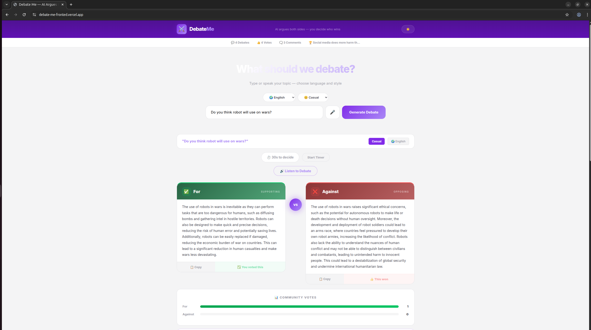
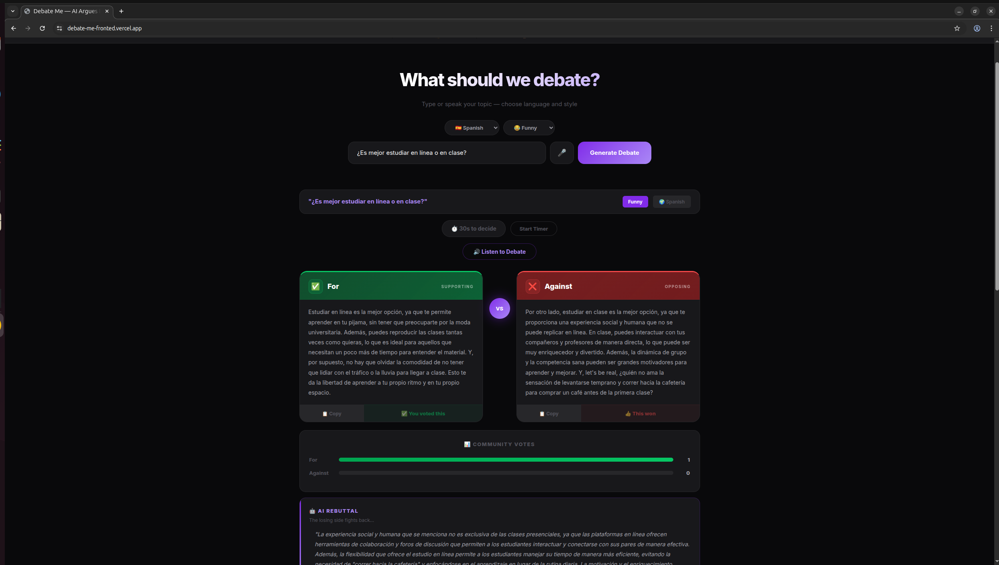
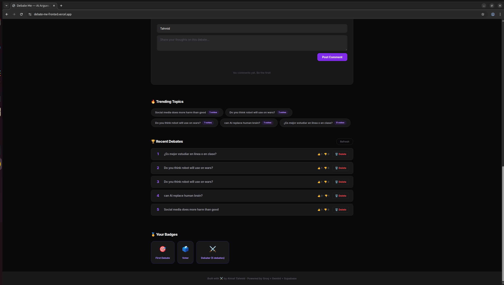

# ⚔️ DebateMe — AI-Powered Debate Arena

> AI argues both sides of any topic. You decide who wins.



---

## 🌐 Live Demo

| | URL |

|---|---|

| 🖥️ Frontend | [debate-me-fronted.vercel.app](https://debate-me-fronted.vercel.app) |
| ⚙️ Backend API | [debate-me-backend.onrender.com](https://debate-me-backend.onrender.com) |

---

## 📖 Project Description

DebateMe is a browser-based web application that uses AI to generate structured debate arguments for any topic a user provides. The application presents the strongest possible case both FOR and AGAINST the topic, then lets users vote on which argument won, post comments, and see what the community thinks.

The project was built as a semester assignment to demonstrate understanding of full-stack web development — combining a semantic HTML5 frontend, a Node.js/Express backend, a PostgreSQL database via Supabase, and multiple AI APIs (Groq and Google Gemini) for argument generation.

What makes DebateMe unique compared to typical semester projects is the AI fallback strategy: Groq (LLaMA 3.3) is used as the primary AI provider, and Google Gemini automatically takes over if Groq's quota is exhausted — ensuring the app always works without manual intervention.

---

## ✨ Features

- 🤖 **AI Debate Generation** — Generates strong FOR and AGAINST arguments using Groq LLaMA 3.3 with automatic Google Gemini fallback
- 🎤 **Voice Input** — Speak your topic using the browser's Web Speech API instead of typing
- 🔊 **Listen to Debate** — Text-to-speech reads both arguments aloud using the Speech Synthesis API
- 👍 **Voting System** — Vote for the winning argument and see live vote bars update in real time
- 🤖 **AI Rebuttal** — After voting, AI generates a counter-argument for the losing side
- 💬 **Comments** — Post and read community discussion on each debate topic
- 🌍 **Language Selector** — Generate debates in 8 languages including English, Spanish, French, Finnish, Arabic, and more
- 😂 **Debate Mode** — Choose between Formal, Casual, Funny, and ELI5 debate styles
- 🔥 **Trending Topics** — See which topics have the most community engagement
- 🏆 **Leaderboard** — Browse all recent debates with vote counts
- 🗑️ **Delete Debate** — Remove any debate topic from the history
- 📊 **Live Stats Bar** — Real-time count of total debates, votes, and comments
- 🌙 **Dark/Light Mode** — Theme toggle saved in localStorage
- 📋 **Copy Argument** — Copy either argument to clipboard with one click
- 🔗 **Share Debate** — Copy a shareable link that pre-fills the topic for anyone who opens it
- ⏱️ **Debate Timer** — 30-second countdown to make your decision
- 🏅 **Badges** — Achievement system rewarding engagement
- 👤 **Username Persistence** — Your name is remembered across sessions via localStorage

---

## 📸 Screenshots

### Home Page


### Generate Debate FOR vs AGAINST Cards



### Community Votes



### AI Rebuttal



### Comments Section



### Trending Topics



### Leaderboard



### Light Mode



### Language & Mode Selector



### Stats Bar



---

## 🏗️ Architecture

```text
┌─────────────────────────────────────────────────────┐
│                    User Browser                      │
│         HTML5 + CSS3 + Vanilla JavaScript            │
│              Deployed on Vercel                      │
└──────────────────────┬──────────────────────────────┘
                       │ fetch() API calls
                       ▼
┌─────────────────────────────────────────────────────┐
│               Express.js Backend                     │
│              Node.js on Render                       │
│                                                      │
│  /api/debate/generate  →  AI argument generation     │
│  /api/debate/vote      →  Record user votes          │
│  /api/debate/rebuttal  →  AI counter-argument        │
│  /api/debate/:id       →  Delete debate              │
│  /api/leaderboard      →  Recent debates             │
│  /api/trending         →  Most voted topics          │
│  /api/comments         →  Post and fetch comments    │
│  /api/stats            →  App-wide statistics        │
└──────┬───────────────────────────┬──────────────────┘
       │                           │
       ▼                           ▼
┌─────────────┐           ┌───────────────────┐
│  Groq API   │           │   Supabase         │
│  (Primary)  │           │   (PostgreSQL)     │
│  LLaMA 3.3  │           │                   │
└──────┬──────┘           │  debates table     │
       │ if quota         │  comments table    │
       │ exhausted        │  badges table      │
       ▼                  └───────────────────┘
┌─────────────┐
│ Gemini API  │
│ (Fallback)  │
│ 2.0 Flash   │
└─────────────┘
```

---

## 🗃️ Database Schema

### `debates` table

| Column | Type | Description |

|---|---|---|
| id | UUID | Auto-generated primary key |
| topic | TEXT | The debate topic |
| for_votes | INT4 | Number of votes for |
| against_votes | INT4 | Number of votes against |
| language | TEXT | Language of the debate |
| mode | TEXT | Debate style (Formal/Funny etc.) |
| created_at | TIMESTAMP | Auto-generated timestamp |

### `comments` table

| Column | Type | Description |

|---|---|---|
| id | UUID | Auto-generated primary key |
| debate_id | UUID | Foreign key to debates |
| username | TEXT | Commenter's name |
| comment | TEXT | Comment content |
| created_at | TIMESTAMP | Auto-generated timestamp |

---

## 🧰 Technology Stack

| Layer | Technology | Reason |

|---|---|---|
| Frontend | HTML5, CSS3, Vanilla JavaScript | Assignment requirement, full control |
| Backend | Node.js + Express.js | Lightweight, fast, easy to deploy |
| Primary AI | Groq API (LLaMA 3.3 70B) | Free tier, extremely fast responses |
| Fallback AI | Google Gemini 2.0 Flash | Free tier, automatic fallback |
| Database | Supabase (PostgreSQL) | Free tier, professional, no complex setup |
| Frontend Deploy | Vercel | Free, instant HTTPS, GitHub integration |
| Backend Deploy | Render | Free tier, works with Node.js |
| Voice Input | Web Speech API | Built into browser, no library needed |
| Text to Speech | Speech Synthesis API | Built into browser, no library needed |

---

## 📁 Project Structure

```text
debate-me/
├── frontend/
│   ├── index.html          # Semantic HTML5 structure
│   ├── style.css           # Full responsive CSS with dark/light mode
│   └── app.js              # All client-side JavaScript logic
├── backend/
│   ├── server.js           # Express server entry point
│   ├── routes/
│   │   ├── debate.js       # Debate generation, voting, rebuttal, delete
│   │   ├── leaderboard.js  # Recent debates endpoint
│   │   ├── comments.js     # Comments CRUD endpoints
│   │   ├── stats.js        # App statistics endpoint
│   │   └── trending.js     # Trending topics endpoint
│   ├── .env                # Environment variables (not committed)
│   └── package.json        # Node.js dependencies
├── screenshots/            # App screenshots for documentation
└── README.md               # This file
```

---

## 🚀 Setup Instructions

### Prerequisites

- Node.js v20+
- A Supabase account
- A Groq API key (free at console.groq.com)
- A Google Gemini API key (free at aistudio.google.com)

### 1. Clone the repository

```bash
git clone https://github.com/AhnafTahmid98/browser-programming.git
cd "browser-programming/Semester Project Work/debate-me"
```

### 2. Set up the database

Go to your Supabase project → SQL Editor and run:

```sql
CREATE TABLE debates (
  id UUID DEFAULT gen_random_uuid() PRIMARY KEY,
  topic TEXT NOT NULL,
  for_votes INT4 DEFAULT 0,
  against_votes INT4 DEFAULT 0,
  language TEXT DEFAULT 'English',
  mode TEXT DEFAULT 'Formal',
  created_at TIMESTAMP WITH TIME ZONE DEFAULT NOW()
);

CREATE TABLE comments (
  id UUID DEFAULT gen_random_uuid() PRIMARY KEY,
  debate_id UUID REFERENCES debates(id) ON DELETE CASCADE,
  username TEXT NOT NULL DEFAULT 'Anonymous',
  comment TEXT NOT NULL,
  created_at TIMESTAMP WITH TIME ZONE DEFAULT NOW()
);

ALTER TABLE debates DISABLE ROW LEVEL SECURITY;
ALTER TABLE comments DISABLE ROW LEVEL SECURITY;
```

### 3. Set up the backend

```bash
cd backend
npm install
```

Create a `.env` file:

```env
GROQ_API_KEY=your_groq_api_key
GEMINI_API_KEY=your_gemini_api_key
SUPABASE_URL=your_supabase_project_url
SUPABASE_KEY=your_supabase_anon_key
PORT=3000
```

Start the backend:

```bash
node server.js
```

### 4. Run the frontend

```bash
cd ../frontend
npx http-server . -p 5000
```

Open in browser:

```text
http://localhost:5000
```

---

## 🤖 AI Usage Disclosure

I used AI tools throughout this project. Here is a full breakdown:

### Tools Used

- **Claude (Anthropic)** — Primary development assistant
- **GitHub Copilot** — Inline code suggestions in VS Code

### What Was AI-Generated

- Initial boilerplate for Express routes
- Supabase query syntax
- CSS variables and responsive grid layout
- The dual-provider AI fallback logic structure

### What I Manually Modified

- All API prompts were written and tuned by me to get structured JSON output reliably
- The fallback strategy between Groq and Gemini was my own idea and I adapted the code to implement it
- The database schema was designed by me based on the features I wanted
- All feature ideas (voice input, text-to-speech, badges, timer, share link) were my own decisions
- Debugging all environment issues (Node version, Supabase URL format, Gemini model names) was done by me
- Deployment configuration on Render and Vercel was set up by me

### Reflection

Using AI tools accelerated development significantly, but understanding every line of code was essential — I had to debug multiple real issues throughout the project including incorrect API model names, Node.js version conflicts, Supabase URL format errors, and browser security restrictions on the Web Speech API. These could only be solved by genuinely understanding what the code was doing.

---

## 🔮 Future Improvements

- **User authentication** — Allow users to create accounts and track their debate history
- **Real-time updates** — Use Supabase realtime subscriptions to show new votes and comments live without refreshing
- **Debate rooms** — Let multiple users debate the same topic simultaneously
- **AI scoring** — Let AI judge which argument was stronger based on logic and evidence
- **Mobile app** — Build a React Native version for iOS and Android
- **Embed widget** — Allow other websites to embed a debate widget

---

## 👤 Author

### Ahnaf Tahmid

- GitHub: [@AhnafTahmid98](https://github.com/AhnafTahmid98)

---

## 📄 License

This project was built as a semester assignment. All rights reserved © 2026 Ahnaf Tahmid.
