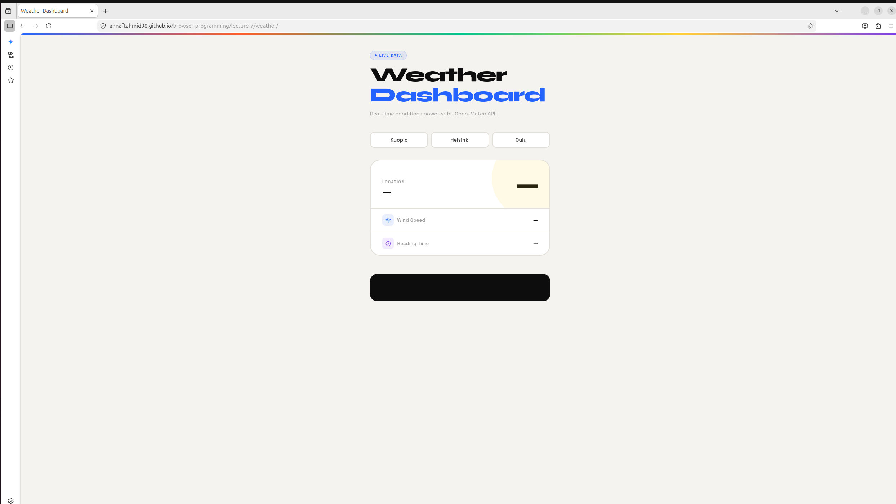
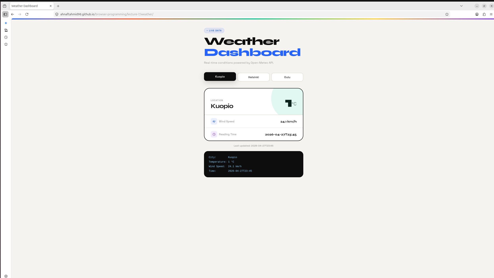

# Weather Dashboard

> Live weather data fetched from the [Open-Meteo](https://open-meteo.com/) public API — no API key required.

---

## Screenshot

### Default State



### Loaded State



---

## Project Structure

```text
lecture-7/weather/
├── index.html       — Page structure and layout
├── script.js        — API logic and DOM updates
├── exercise.css     — All styles and animations
├── README.md        — This file
└── screenshots/
    ├── default.png  — Dashboard on load
    └── loaded.png   — Dashboard after selecting a city
```

---

## Features

- Live weather data from Open-Meteo API
- Three city buttons — Kuopio, Helsinki, Oulu
- Displays temperature, wind speed, and reading time
- Background theme shifts based on temperature (`cold` / `mild`)
- Error handling with user-friendly status messages
- Animated page load with staggered fade-up transitions

---

## How It Works — Step by Step

### Step 1 — Page Loads

Open `index.html` in any browser. The CSS animations run and three city buttons appear. The card shows dashes as placeholders — no data is fetched yet.

### Step 2 — User Clicks a City

Clicking a city button calls `loadWeatherByCity()` in `script.js`, passing the city name and its coordinates. The active button gets a bold black highlight.

### Step 3 — API Request Is Sent

The function builds the Open-Meteo URL with the coordinates and sends a `fetch()` request. The status bar shows _"Fetching weather for [city]…"_ while waiting.

```js
const url = `https://api.open-meteo.com/v1/forecast
  ?latitude=${latitude}&longitude=${longitude}
  &current=temperature_2m,wind_speed_10m`

const response = await fetch(url)
```

### Step 4 — JSON Is Parsed

The response is converted to JSON with `response.json()`. We then read the nested fields inside `data.current`.

```js
const data        = await response.json()
const temperature = data.current.temperature_2m
const wind        = data.current.wind_speed_10m
const time        = data.current.time
```

### Step 5 — DOM Is Updated

Values are written into the HTML elements using `textContent`. The card border lights up and the background switches to `cold` or `mild` based on temperature.

```js
cityText.textContent        = cityName
temperatureText.textContent = temperature
windText.textContent        = wind + " km/h"
timeText.textContent        = time

document.body.className = temperature < 0 ? "cold" : "mild"
```

### Step 6 — Errors Are Caught

The entire fetch block is wrapped in `try/catch`. If the HTTP status is not OK, an error is thrown manually and shown in the status bar and console log area.

```js
if (!response.ok) {
    throw new Error("HTTP Error: " + response.status)
}

// catch block:
log("Error: " + error.message)
setStatus("Failed — " + error.message, "error")
```

---

## City Coordinates

| City     | Latitude | Longitude |
|----------|----------|-----------|
| Kuopio   | 62.8924  | 27.6770   |
| Helsinki | 60.1699  | 24.9384   |
| Oulu     | 65.0121  | 25.4651   |

---

## API Reference

**Base URL:** `https://api.open-meteo.com/v1/forecast`

**Example request (Kuopio):**

```text
https://api.open-meteo.com/v1/forecast?latitude=62.8924&longitude=27.6770&current=temperature_2m,wind_speed_10m
```

**Example response:**

```json
{
  "current": {
    "temperature_2m": 3.4,
    "wind_speed_10m": 11.2,
    "time": "2026-04-28T12:00"
  }
}
```

---

## Short Reflection

**Why is this page called dynamic?**
The page is dynamic because its content changes after the initial load based on user actions. The weather values are not hardcoded in HTML — they are fetched live from an external API and injected into the DOM at runtime using JavaScript.

**What does the API give us?**
The Open-Meteo API returns structured weather data for any geographic coordinates we provide. For each request it gives us real-time values such as temperature, wind speed, and timestamp — delivered as a JSON object over HTTP.

**Why is JSON useful here?**
JSON is useful because it is lightweight, human-readable, and natively supported in JavaScript. The browser can parse the API response directly with `response.json()`, and we can immediately access nested values like `data.current.temperature_2m` without any extra processing.

**Why is one reusable function better than copy-pasting?**
A reusable function means any fix or improvement only needs to be made in one place. If the API URL changes or we add a new feature, we update `loadWeatherByCity()` once and all three city buttons benefit automatically. Copying the same code three times makes the project harder to maintain and easier to break.

---

## Built With

- HTML5
- CSS3 (custom properties, animations, backdrop-filter)
- Vanilla JavaScript (Fetch API, async/await)
- [Open-Meteo API](https://open-meteo.com/) — free, no key required
- [Google Fonts](https://fonts.google.com/) — Syne + Space Grotesk
