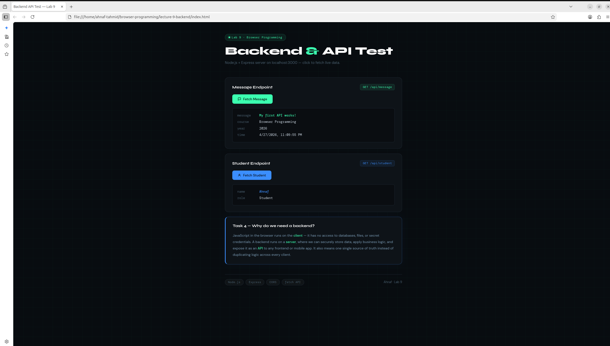
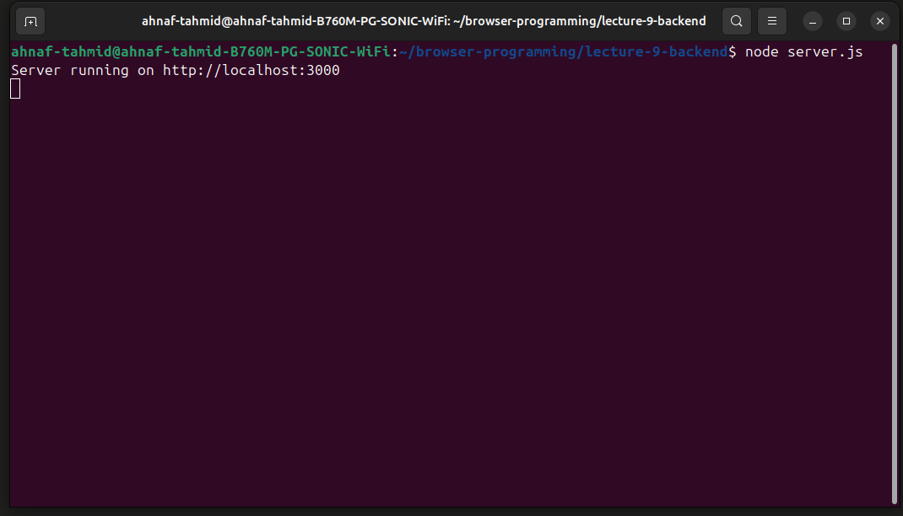
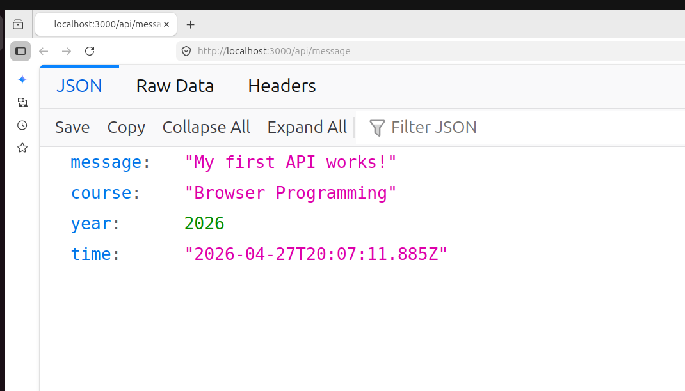
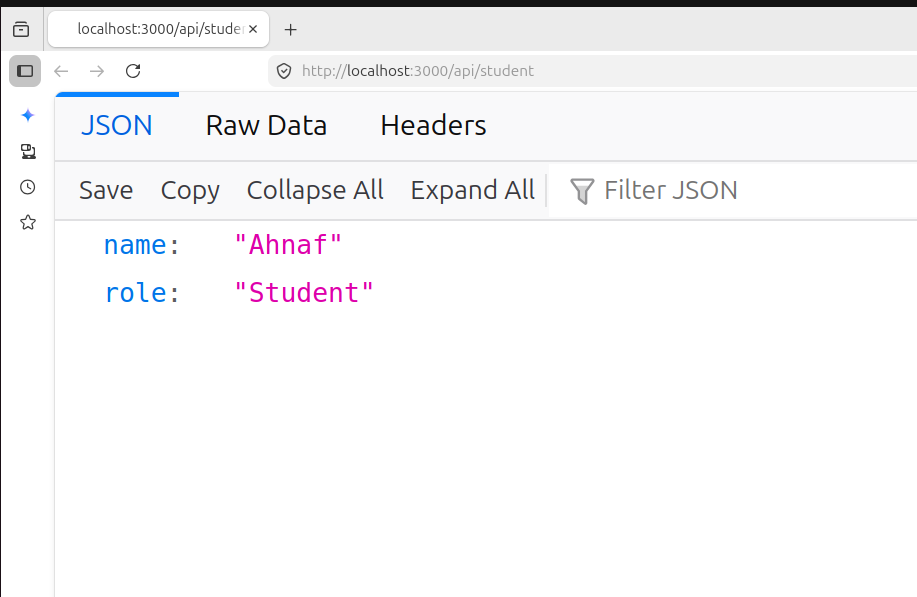

# Lab 9 — My First Backend & API

**Course:** Browser Programming  
**Student:** Ahnaf  
**Date:** April 2026

---

## 📸 Preview



---

## 📌 What This Project Does

This is my first backend project. I built a simple REST API using **Node.js** and **Express**, then connected it to a frontend using the browser's `fetch()` API.

When you click the buttons on the page, the browser sends a request to the local server and displays the JSON response — live, without refreshing the page.

---

## 🗂️ Project Structure

```
lecture-9-backend/
├── server.js           ← Express backend with API routes
├── index.html          ← Frontend UI
├── script.js           ← fetch() calls to the backend
├── screenshots/        ← Screenshots for this README
│   ├── server-running.png
│   ├── api-message.png
│   ├── api-student.png
│   └── frontend.png
├── package.json
└── README.md
```

---

## ⚙️ How to Run

### 1. Install dependencies

```bash
npm install
```

### 2. Start the server

```bash
node server.js
```

You should see this in the terminal:



### 3. Open the frontend

Open `index.html` in your browser (double-click or drag into browser), then click the buttons.

---

## 🔌 API Endpoints

### `GET /`

Basic health check — confirms the server is alive.

```
Server is running!
```

---

### `GET /api/message`

Returns a JSON object with a message, course name, year, and current timestamp.

**Response:**

```json
{
  "message": "My first API works!",
  "course": "Browser Programming",
  "year": 2026,
  "time": "2026-04-27T19:43:00.942Z"
}
```



---

### `GET /api/student`

Returns student info.

**Response:**

```json
{
  "name": "Ahnaf",
  "role": "Student"
}
```



---

## ✅ Tasks

| # | Task | Status |
|---|------|--------|
| 1 | Changed message to `"My first API works!"` | ✅ Done |
| 2 | Added `course`, `year`, `time` fields and displayed them in UI | ✅ Done |
| 3 | Created `/api/student` endpoint and called it from frontend | ✅ Done |
| 4 | Answered why we need a backend (see below) | ✅ Done |
| Bonus | Loading text, formatted date, error message in UI | ✅ Done |

---

## 💡 Task 4 — Why do we need a backend?

JavaScript in the browser only runs on the **client side** — it has no access to databases, files, or secret credentials like API keys. A backend runs on a **server**, where we can:

- Store and retrieve data securely
- Apply business logic that users shouldn't see or modify
- Expose a clean **API** that any frontend or mobile app can use

Without a backend, every user could see and manipulate the logic directly. A backend gives us one controlled source of truth.

---

## 📦 Dependencies

| Package | Version | Purpose |
|---------|---------|---------|
| [express](https://expressjs.com/) | ^4.x | Web framework for Node.js |
| [cors](https://www.npmjs.com/package/cors) | ^2.x | Allows frontend to call the API from a different origin |

---

## 🛠️ Troubleshooting

| Problem | Solution |
|---------|----------|
| `Cannot GET /` | Server is not running — run `node server.js` |
| Buttons do nothing | Open DevTools (`F12`) → Console tab and check for errors |
| CORS error in console | Make sure `app.use(cors())` is in `server.js` |
| Port already in use | Change `const PORT = 3000` to another number like `3001` |
