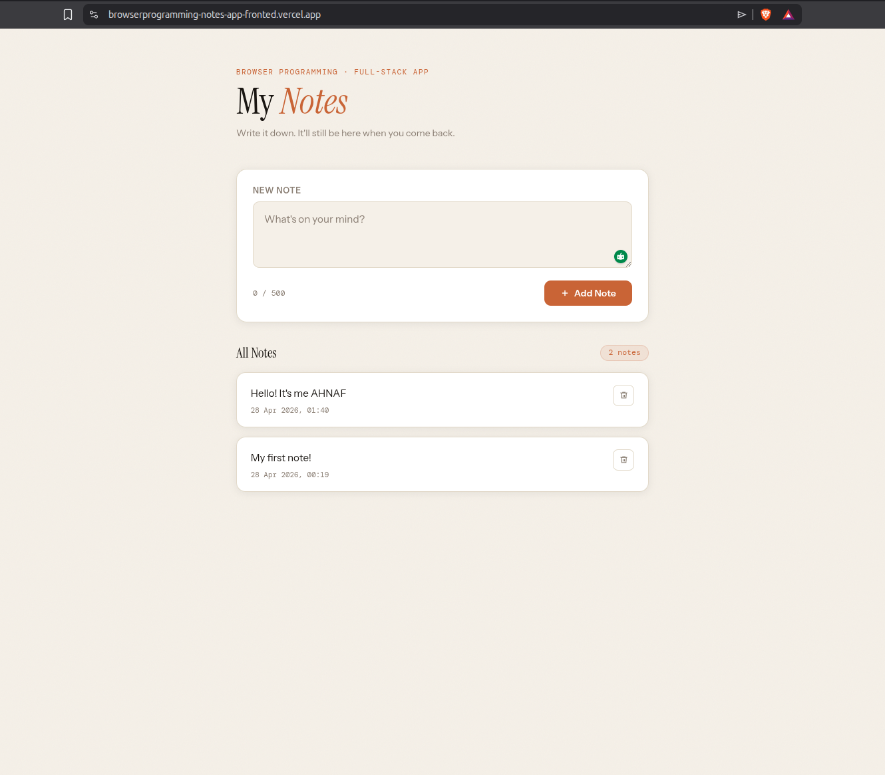
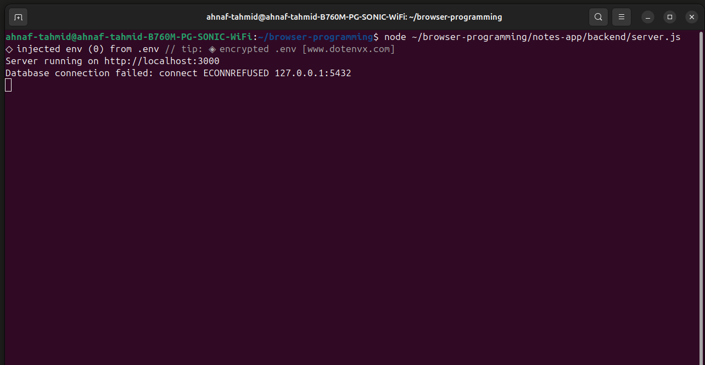
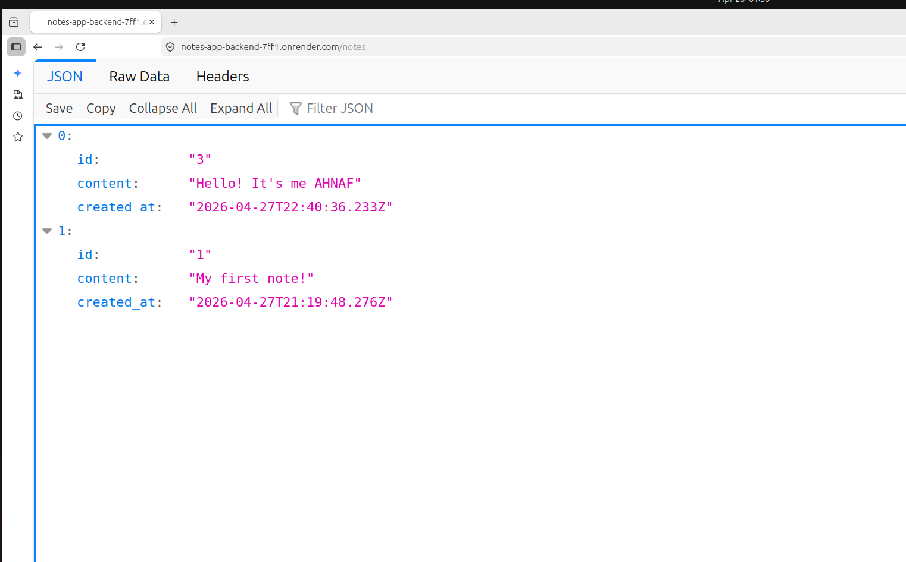
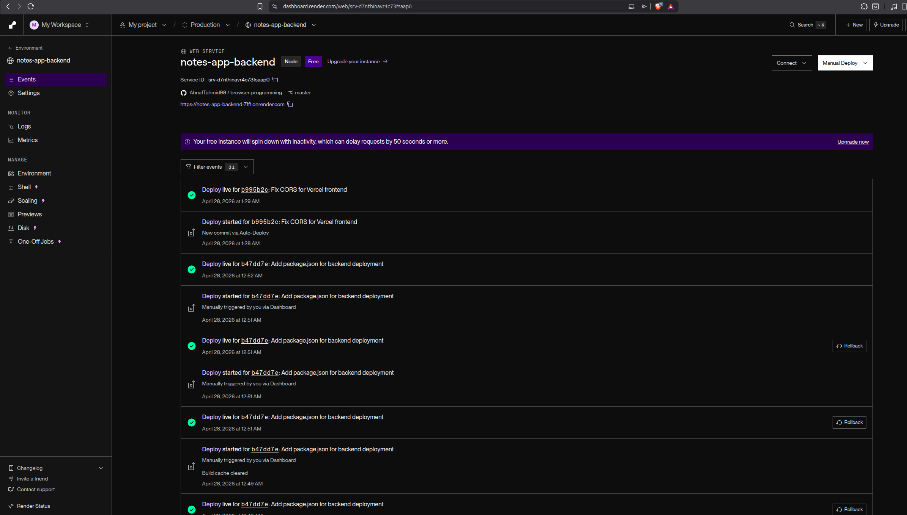
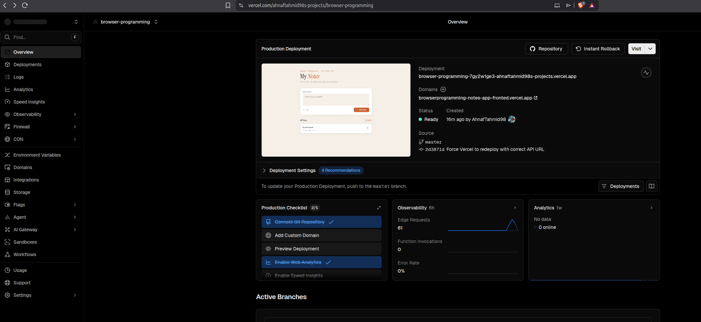

# Notes App — Full-Stack Assignment

**Course:** Browser Programming  
**Student:** Ahnaf  
**Date:** April 2026

---

## 📸 Preview



---

## 🔗 Live Links

| | URL |

|---|---|
| **Frontend** | <https://browserprogramming-notes-app-fronted.vercel.app> |
| **Backend API** | <https://notes-app-backend-7ff1.onrender.com> |
| **GitHub** | <https://github.com/AhnafTahmid98/browser-programming> |

---

## 📌 What This App Does

A simple full-stack Notes App where you can:

- ✅ Add a note
- ✅ View all notes
- ✅ Delete a note
- ✅ Notes persist after page refresh (stored in database)

---

## 🏗️ Architecture

```text
Frontend (Vercel)
      ↓  fetch()
Backend API (Render — Node.js + Express)
      ↓  pg
Database (Supabase — PostgreSQL)
```

---

## 🗂️ Project Structure

```text
notes-app/
├── frontend/
│   ├── index.html              ← UI
│   └── app.js                  ← fetch() calls to backend
├── backend/
│   ├── server.js               ← Express API
│   ├── .env.example            ← environment variable template
│   └── package.json
├── screenshots/
│   ├── frontend.png            ← app UI
│   ├── server-running.png      ← terminal with server
│   ├── api-notes.png           ← GET /notes response
│   ├── render-deploy.png       ← Render dashboard
│   └── vercel-deploy.png       ← Vercel dashboard
└── README.md
```

---

## ⚙️ Local Setup

### 1. Clone the repo

```bash
git clone https://github.com/AhnafTahmid98/browser-programming.git
cd browser-programming/notes-app
```

### 2. Set up the backend

```bash
cd backend
npm install
cp .env.example .env
```

Edit `.env` and add your Supabase connection string:

```env
DATABASE_URL=your_supabase_connection_string_here
PORT=3000
```

### 3. Set up the database in Supabase

Open the Supabase SQL Editor and run:

```sql
CREATE TABLE IF NOT EXISTS notes (
  id BIGSERIAL PRIMARY KEY,
  content TEXT NOT NULL,
  created_at TIMESTAMP DEFAULT NOW()
);
```

### 4. Start the backend

```bash
node server.js
```

You should see:



### 5. Open the frontend

Open `frontend/index.html` in your browser. That's it.

---

## 🔌 API Endpoints

| Method | Endpoint | Description |
| -------- | ---------- | ------------- |

| GET | `/notes` | Return all notes, newest first |
| POST | `/notes` | Create a new note |
| DELETE | `/notes/:id` | Delete a note by ID |

### Example responses

#### GET /notes



```json
[
  {
    "id": 1,
    "content": "My first note!",
    "created_at": "2026-04-27T19:43:00.942Z"
  }
]
```

#### POST /notes

```json
{ "content": "My first note!" }
```

#### DELETE /notes/1

```json
{ "message": "Note deleted", "note": { "id": 1 } }
```

---

## 🚀 Deployment

### Backend → Render

1. Go to [render.com](https://render.com) and create a free account
2. New → Web Service → connect your GitHub repo
3. Set root directory to `notes-app/backend`
4. Start command: `node server.js`
5. Add environment variables:
   - `DATABASE_URL` → your Supabase connection string
   - `PORT` → `3000`
6. Deploy



### Frontend → Vercel

1. Go to [vercel.com](https://vercel.com) and create a free account
2. In `frontend/app.js`, change `API_URL` to your Render backend URL
3. Commit and push to GitHub
4. Import project in Vercel → set root directory to `notes-app/frontend`
5. Deploy



---

## 📦 Dependencies

| Package | Purpose |
| --------- | --------- |

| `express` | Web framework |
| `cors` | Allow frontend to call backend |
| `pg` | PostgreSQL client for Supabase |
| `dotenv` | Load `.env` variables |

---

## 🛠️ Troubleshooting

| Problem | Solution |
| --------- | ---------- |

| `Cannot connect to database` | Check `DATABASE_URL` in `.env` |
| CORS error in browser | Make sure `app.use(cors({ origin: "*" }))` is in `server.js` |
| Notes not saving after refresh | Database connection issue — check Supabase logs |
| Render backend sleeping | Free tier sleeps after inactivity — first request takes ~30s |
